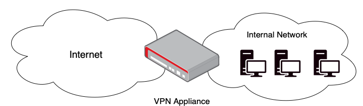

# Exploitation Of Networking Appliances

Edge of network appliances like VPNs and Citrix access gateways are often installed to grant roaming users access to internal resources like files and applications or, in the case of Exchange servers, eMail. These appliances straddle the gap between the internet and the internal network, their somewhat precarious location (known as the DMZ or just edge) makes them an attractive target for attackers because successful compromise could create a pathway from the attacker’s computer directly into the victim’s internal network.

_**If your network has edge appliances, they must be promptly patched when vulnerabilities are disclosed; the sooner, the better.**_

It's possible to detect such vulnerabilities with vulnerability scanners like Tenable or Qualys, but these solutions can be costly as they require long term human and financial investment. Alternatively, system administrators should sign up for a free notification service like [Secalerts.co ](https://secalerts.co) , which will send a notification whenever the technologies you are running become vulnerable, which in turn should trigger internal workflows to patch appliances.

Internal patching workflow for these systems should be concise and accessible. Long documents tucked away in a dark corner of a SharePoint library are useless. Making something hard to read means people won't bother doing so. Help IT administrators make patching documentation accessible and as close to a one-pager as possible. Drop legalese and versioning tables to instead give way for technical information that technical people require.

A patching document one-pager should convey the following information:

* An agreed time frame between detection and remediation of vulnerabilities. Most businesses aim for a 30-day turnaround; however, the less, the better. Recent CVEs come with sharp teeth that should be addressed as soon as possible.
* Who is responsible for receiving the alerts from the detection system (whether a vulnerability scanner or alerting service like Secalerts) and starting the process, perhaps raising change requests and booking technical resource time.
* Who is responsible for actioning this alert as the technical resource that will apply the updates.
* How the patches are installed (if it’s any more difficult than clicking “Install Updates.”
* A section or process for the above persons to sign off that they have completed their parts of the patching process and confirmed the patches had been installed.

In some cases, it's also possible to detect appliance attacks via their logs, although this varies by vendor and vulnerability. Knowing which logs to look at isn't always understood until long after a vulnerability and corresponding exploit have been published. In most cases, the appliance will write a Syslog message or have a particular file in a specific location that indicates the system has been compromised. It's probably best not to count on this method for detecting networking appliance intrusions. Prevention is better than cure, and in this case, prevention comes in the form of prompt patching.

It is essential to ensure that administration consoles for networking appliances are not directly exposed to the internet. In some cases, an exposed control panel on 443 with default credentials is as bad as a critical vulnerability. Attackers can log in and attack the appliance directly by elevating privileges on the local OS. They could steal credentials or use the appliance as a stepping stone into a victim network.

If your management team need some encouragement to install patches, here are some real-world examples of network edge appliances leading to breaches:

* [Citrix Application Gateway Remote Code Execution ](https://www.zdnet.com/article/hackers-target-unpatched-citrix-servers-to-deploy-ransomware/)
* [Pulse Secure VPN Appliance](https://www.cisa.gov/uscert/ncas/current-activity/2021/07/21/malware-targeting-pulse-secure-devices)
* [ Unpatched exchanged leads to domain-wide ransomware](https://thedfirreport.com/2021/11/15/exchange-exploit-leads-to-domain-wide-ransomware/)
* [- Sonicwall Remote Code Execution ](https://threatpost.com/critical-sonicwall-vpn-bugs-appliance-takeover/176869/)
